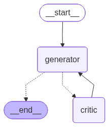
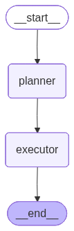
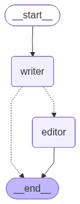
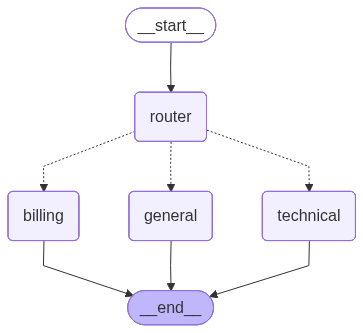

# Agentic Design Patterns with LangGraph

This repository contains practical implementations of core agentic AI design patterns using [LangGraph](https://github.com/langchain-ai/langgraph). These patterns represent the shift from simple prompting to iterative, stateful AI workflows.

## Patterns Included

### 1. [Reflection (Self-Correction)](./patterns/01_reflection/example.py)
*   **Concept:** An agent generates a response, critiques it, and then refines the output based on that critique.
*   **Workflow:** `Generator -> Critic -> Generator (refined)`
*   **Example:** A code generation assistant that iterates on a Python function to improve efficiency and readability.
*   **Graph:** 

### 2. [Tool Use (ReAct)](./patterns/02_tool_use/example.py)
*   **Concept:** An agent uses external tools in a Thought-Action-Observation loop to gather data and solve complex problems.
*   **Workflow:** `Agent -> Tools -> Agent (final answer)`
*   **Example:** A research assistant that uses mock weather and calculation tools to answer specific queries.
*   **Graph:** 

### 3. [Planning](./patterns/03_planning/example.py)
*   **Concept:** A "Planner" agent decomposes a high-level task into actionable sub-tasks, which are then sequentially executed.
*   **Workflow:** `Planner -> Executor (loop) -> End`
*   **Example:** A marketing strategist that breaks down a goal into specific, executable steps.
*   **Graph:** 

### 4. [Multi-Agent Collaboration](./patterns/04_multi_agent/example.py)
*   **Concept:** Multiple specialized agents (e.g., a "Writer" and an "Editor") work together in a coordinated workflow.
*   **Workflow:** `Writer -> Editor -> End (or loop back)`
*   **Example:** A content creation team producing a blog post through iterative draft-and-review cycles.
*   **Graph:** 

### 5. [Dynamic Routing](./patterns/05_dynamic_routing/example.py)
*   **Concept:** A "Router" agent analyzes incoming requests and directs them to the most appropriate specialized agent.
*   **Workflow:** `Router -> Technical/Billing/General -> End`
*   **Example:** A customer support system that routes inquiries to Technical, Billing, or General Inquiry agents.
*   **Graph:** 

## Getting Started

1.  **Environment Setup:**
    Create a `.env` file in the root directory and add your OpenAI API key:
    ```env
    OPENAI_API_KEY=your_api_key_here
    ```

2.  **Install Dependencies (using uv):**
    ```bash
    uv sync
    ```

3.  **Run Examples:**
    Each pattern can be executed directly as a script:
    ```bash
    uv run patterns/01_reflection/example.py
    ```

## Requirements
*   Python 3.13+
*   LangGraph
*   LangChain OpenAI
*   Grandalf (for ASCII graph visualization)
